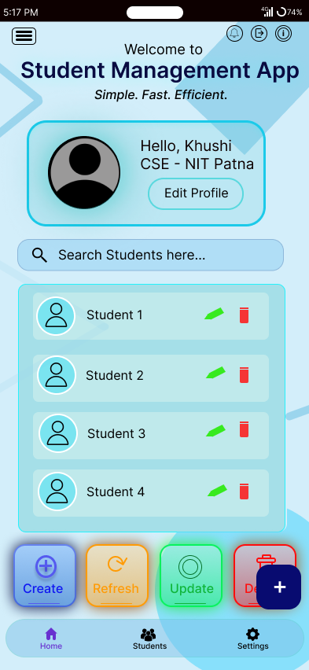

# khushi

A new Flutter project.

## Getting Started

This project is a starting point for a Flutter application.

A few resources to get you started if this is your first Flutter project:

- [Learn Flutter](https://docs.flutter.dev/get-started/learn-flutter)
- [Write your first Flutter app](https://docs.flutter.dev/get-started/codelab)
- [Flutter learning resources](https://docs.flutter.dev/reference/learning-resources)

For help getting started with Flutter development, view the
[online documentation](https://docs.flutter.dev/), which offers tutorials,
samples, guidance on mobile development, and a full API reference.


# 📚 Student Management App

A Flutter-based Student Management Application designed to manage student records with a clean and user-friendly interface. The application uses Firebase Cloud Firestore as the backend for storing and managing student data.

## 🚀 Features

- 📋 View student details
- ➕ Create new student records
- ✏️ Update existing student information
- 🗑️ Delete student records
- 🔍 Search students
- ☁️ Firebase Firestore integration
- 📱 Responsive and modern Flutter UI

## 🛠️ Tech Stack

- Flutter
- Dart
- Firebase Core
- Cloud Firestore
- Material Design

## 📸 UI Preview

> Replace the image below with your project screenshot.



## 📂 Project Structure

```
lib/
├── main.dart
├── home_screen.dart
├── firebase_options.dart
└── ...
```

## ⚙️ Getting Started

### Clone the repository

```bash
git clone <repository-url>
```

### Install dependencies

```bash
flutter pub get
```

### Configure Firebase

1. Create a Firebase project.
2. Enable Cloud Firestore.
3. Add your Flutter app to Firebase.
4. Download the `google-services.json` file and place it inside:

```
android/app/
```

5. Configure Firebase:

```bash
dart pub global run flutterfire_cli:flutterfire configure
```

### Run the project

```bash
flutter run
```

## Features of Student Management App

A Flutter-based Student Management Application that enables users to efficiently manage student records. The application supports Create, Read, Update, Delete (CRUD), Search, and Refresh operations using Firebase Cloud Firestore with a clean and responsive user interface.

## 🔮 Future Improvements

- User Authentication
- Profile Editing
- Real-time Student Data
- Better Search & Filtering
- Dark Mode

## 👩‍💻 Developer

**Khushi Gudadhe**

B.Tech CSE, NIT Patna

---

⭐ If you like this project, consider giving it a star!